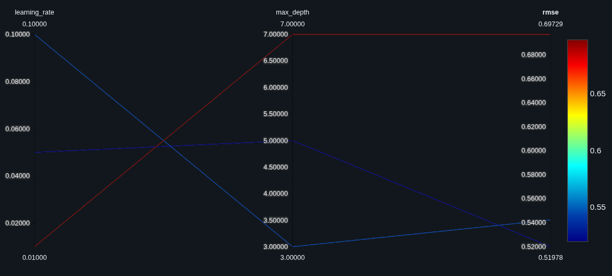

# ML Experiment Tracking with MLflow

## 1. Task Description

This project is part of the Samsung Innovation Campus program. It uses **MLflow** to track and compare machine learning experiments on a **House Price Prediction** problem.

A `GradientBoostingRegressor` is trained three times on the **California Housing** dataset (80% training / 20% validation, fixed random seed), each time with different hyperparameters. For every run, MLflow records:

- **Parameters:** `max_depth`, `learning_rate` (plus `n_estimators` and `seed`)
- **Metrics:** RMSE, MAE, R²
- **Artifacts:** the trained model

The best model is selected using **RMSE** as the primary metric.

> Note: the target (`MedHouseVal`) is in units of $100,000, so an RMSE of 0.52 means predictions are off by about $52,000 on average.

## 2. How to Run

```bash
# 1. Clone the repository and enter the folder
git clone <your-repo-url>
cd mlflow-task

# 2. Create and activate a virtual environment
python -m venv .venv
source .venv/bin/activate        # Windows: .venv\Scripts\activate

# 3. Install dependencies
pip install -r requirements.txt

# 4. Train the three experiments (logs everything to MLflow)
python train.py

# 5. Open the MLflow UI (run from the same folder as train.py)
mlflow ui
```

Then open <http://localhost:5000> and select the `california-housing-gbr` experiment.

## 3. MLflow Experiment Results



<!-- TODO: add screenshot of the MLflow UI (runs table sorted by rmse, or the Compare view) at screenshots/mlflow-results.png -->

## 4. Comparison Table

| Run | Max Depth | Learning Rate | RMSE | MAE | R² |
|---|---|---|---|---|---|
| Run 1 | 3 | 0.1 | 0.5422 | 0.3716 | 0.7756 |
| Run 2 | 5 | 0.05 | **0.5198** | **0.3531** | **0.7938** |
| Run 3 | 7 | 0.01 | 0.6973 | 0.5311 | 0.6290 |

All runs use `n_estimators=100` and `random_state=42`, so only `max_depth` and `learning_rate` change between runs.

## 5. Selected Best Model

**Run 2** (`max_depth = 5`, `learning_rate = 0.05`) with a validation RMSE of **0.52**.

## 6. Why This Model Was Selected

The three runs can be compared using the MLflow parallel coordinates visualization. The first axis shows `learning_rate`, the middle axis shows `max_depth`, and the last axis shows `rmse`. Since a lower `rmse` means a better model, we look for the run whose line ends lowest on the `rmse` axis. `Run 2` has the lowest `rmse` at 0.52, which means its predictions are off by about $52k on average.

Run 2 also has the best MAE and R², so all three metrics agree on the choice.
